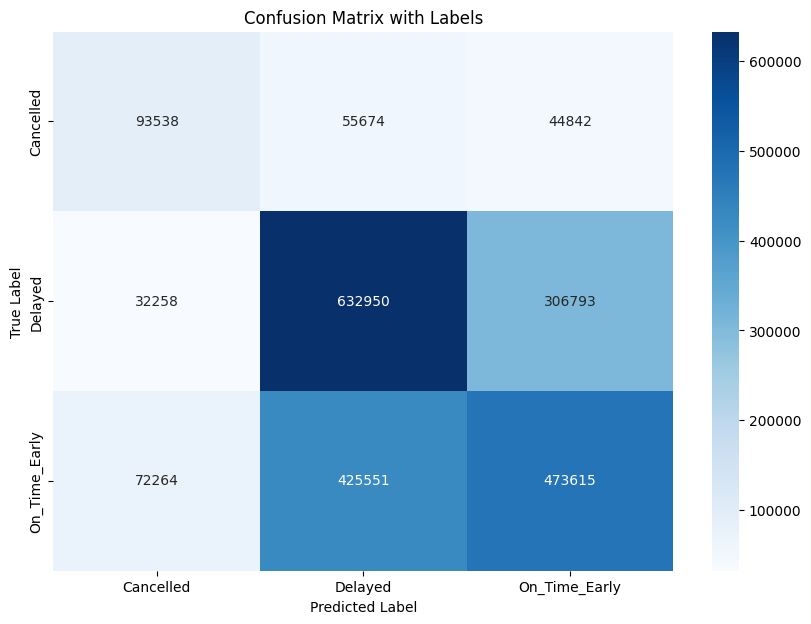

# Flight-Delay-predictions
 Flight delay exercise for RAiD:
-frequency encoding used for categorical features to they can then be used in undersampling using near-miss (required as "cancelled" class severly under represented
-main code and simple EDA in RAiD_assessment.ipynb
-delay prediction in RAiD_assessment_regressor.ipynb

Final confusion matrix:

